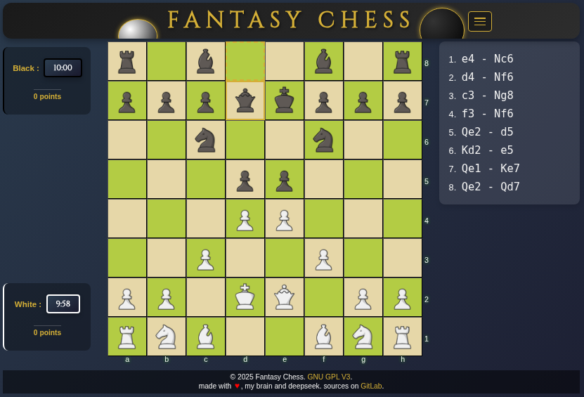
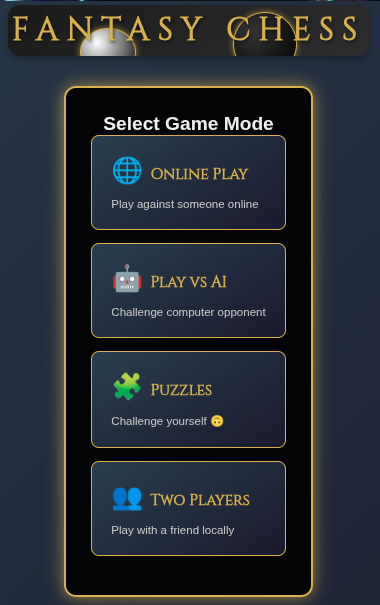

# Fantasy Chess - React Implementation

A modern, feature-rich chess game built with React and TypeScript, offering multiple game modes, online multiplayer, and AI opponents with customizable difficulty levels.





## ✨ Features

### 🎮 Game Modes
- **Player vs Player (PVP)** - Local two-player chess
- **AI Challenge** - Play against computer with 3 difficulty levels
- **Online Multiplayer** - Real-time online matches with room sharing
- **Puzzle Mode** - Chess puzzles and tactical challenges

### 🤖 AI Intelligence
- **Easy, Medium, Hard** difficulty levels
- **Aggressive/Defensive** personality modes
- **Opening book** knowledge with 100+ standard openings
- **Positional evaluation** and endgame strategies

### 🌐 Online Features
- **Room-based multiplayer** with shareable URLs
- **Real-time game synchronization**
- **User authentication** and session management
- **Game history** and persistence

### 🎨 Visual Enhancements
- **Multiple themes** (Classic, Mystical, Hanna, First Blood)
- **Animated moves** and highlight effects
- **Responsive design** for all devices
- **Custom piece sets** and board styles

### ⚡ Technical Features
- **TypeScript** for type safety
- **PHP backend** with RESTful API
- **MySQL database** for game persistence
- **Timer system** with configurable time controls
- **Move validation** using chess.js

## 🏗️ Project Structure

```
react-fantasy-chess/
├── public/                 # Static assets
│   ├── index.html
│   ├── .htaccess
│   └── js/
├── src/
│   ├── components/         # React components
│   │   ├── Auth/          # Authentication forms
│   │   ├── Board/         # Chess board components
│   │   ├── Game/          # Game mode components
│   │   ├── Burger.tsx     # Mobile menu
│   │   ├── Footer.tsx
│   │   ├── Graveyard.tsx  # Captured pieces display
│   │   ├── Logo.tsx
│   │   ├── ThemeSelector.tsx
│   │   ├── TimerDisplay.tsx
│   │   └── UserMenu.tsx
│   ├── backend/           # PHP API backend
│   │   ├── api/
│   │   │   ├── controllers/
│   │   │   │   ├── AuthController.php
│   │   │   │   └── GameController.php
│   │   │   └── index.php  # routing stuff
│   │   ├── sql/           # Database schemas
│   │   │   ├── chess_games.sql
│   │   │   ├── remember_token.sql
│   │   │   └── users.sql
│   │   └── composer.json
│   ├── assets/            # Game assets
│   │   ├── auth.css
│   │   ├── openings.json  # 100+ chess openings
│   │   ├── puzzles.json   # Chess puzzles
│   │   ├── styles.css     # Main stylesheet
│   │   └── themes/        # Visual themes
│   ├── context/           # React contexts
│   │   └── ThemeContext.js
│   ├── hooks/             # Custom React hooks
│   │   ├── useBoardState.ts
│   │   └── useChessTimer.ts
│   ├── logic/             # Game logic
│   │   ├── AIController.ts
│   │   ├── ChessAI.ts     # AI implementation
│   │   ├── ChessEngine.ts # Game engine wrapper
│   │   ├── PgnNotation.ts # Move notation
│   │   ├── PuzzleGame.ts  # Puzzle system
│   │   └── index.js
│   ├── types/             # TypeScript definitions
│   │   ├── chess.ts
│   │   ├── theme.ts
│   │   └── user.ts
│   ├── utils/             # Utilities
│   │   ├── ConsoleBoard.ts
│   │   ├── Cookie.ts
│   │   └── Logger.ts
│   ├── Board.tsx          # Main board component
│   ├── Game.tsx           # Main game component
│   ├── config.ts          # Configuration
│   ├── index.tsx          # App entry point
│   └── __tests__/         # Test files
├── Makefile               # Build automation
├── package.json
├── tsconfig.json
├── .gitlab-ci.yml         # CI/CD configuration
├── .revision              # Version tracking
└── README.md
```

## 🚀 Quick Start

### Prerequisites
- Node.js (v14 or higher)
- PHP 8.1+
- MySQL 5.7+
- Composer (for PHP dependencies)

### Installation

1. **Clone the repository**
   ```bash
   git clone https://gitlab.com/SuperT0f/react-fantasy-chess.git
   cd react-fantasy-chess
   ```

2. **Install frontend dependencies**
   ```bash
   npm install
   ```

3. **Install backend dependencies**
   ```bash
   make backend-deps
   ```

4. **Set up the database**
   ```bash
   # Import SQL schemas from src/backend/sql/
   mysql -u your_user -p your_database < src/backend/sql/users.sql
   mysql -u your_user -p your_database < src/backend/sql/chess_games.sql
   mysql -u your_user -p your_database < src/backend/sql/remember_token.sql
   ```

5. **Configure environment**
   ```bash
   # Copy and edit the .env file
   cp src/backend/.env.example src/backend/.env
   # Edit database credentials in src/backend/.env
   ```

6. **Start development servers**
   ```bash
   # Frontend (React)
   make dev
   
   # Backend (PHP API)
   make php-serve
   ```

## 🛠️ Development

### Available Commands

```bash
make dev              # Start development server
make prod            # Build for production
make test            # Run tests
make type-check      # TypeScript type checking
make clean           # Clean build files
make bump            # Bump version number
make search GREP_ME=term  # Search codebase
```

### Backend API

The PHP backend provides RESTful endpoints:

- `POST /api/login` - User authentication
- `POST /api/register` - User registration
- `GET /api/validate_session` - Session validation
- `POST /api/game/{roomId}` - Create/update game state
- `GET /api/game/{roomId}` - Retrieve game state

### Database Schema

- **users** - User accounts and profiles
- **chess_games** - Game states and room management
- **remember_tokens** - Persistent login sessions

## 🎯 Gameplay Features

### AI Difficulty Levels
- **Easy**: Basic moves, occasional mistakes
- **Medium**: Strategic play, good tactical awareness
- **Hard**: Advanced strategies, minimal errors

### Puzzle System
- Progressive difficulty
- Hint system
- Progress tracking
- Tactical themes

### Timer Options
- Configurable time controls
- Low-time warnings
- Timeout detection

## 🌐 Deployment

### Production Build
```bash
make prod
```

### Deployment to Gandi (as configured)
```bash
make push
```

### GitLab CI/CD
The project includes `.gitlab-ci.yml` for automated deployment to GitLab Pages.

## 🔧 Configuration

### Environment Variables
Create `src/backend/.env`:
```env
DB_HOST=localhost
DB_USER=your_username
DB_PASS=your_password
DB_NAME=fantasy_chess
```

### Theme Customization
Add new themes in `src/assets/themes/` with:
- Piece images (PNG format)
- CSS file for styling
- Update `ThemeContext.js` to include new theme

## 🤝 Contributing

1. Fork the repository
2. Create a feature branch
3. Commit your changes
4. Submit a pull request

### Development Guidelines
- Follow TypeScript best practices
- Maintain consistent code style
- Add tests for new features
- Update documentation accordingly

## 📱 Browser Support

- Chrome 90+
- Firefox 88+
- Safari 14+
- Edge 90+

## 🐛 Troubleshooting

### Common Issues

**PHP API not responding**
- Check PHP server is running on port 4242
- Verify database connection in `.env`
- Ensure CORS headers are properly set

**Authentication problems**
- Clear browser cookies and localStorage
- Check session configuration in `head.php`
- Verify remember token functionality

**Game synchronization issues**
- Check network connectivity
- Verify room IDs match between players
- Monitor browser console for errors

## 📄 License

This project is licensed under the [GNU GPL V3](./LICENCE.md) License.

## 🔗 Links

- **Live Demo**: [Fantasy Chess](https://fantasy-chess.prigent.site/play/)
- **Repository**: [GitLab](https://gitlab.com/SuperT0f/react-fantasy-chess)
- **Issue Tracker**: [GitLab Issues](https://gitlab.com/SuperT0f/react-fantasy-chess/-/issues)

---

*Built with ♥ using React, TypeScript, and chess.js*